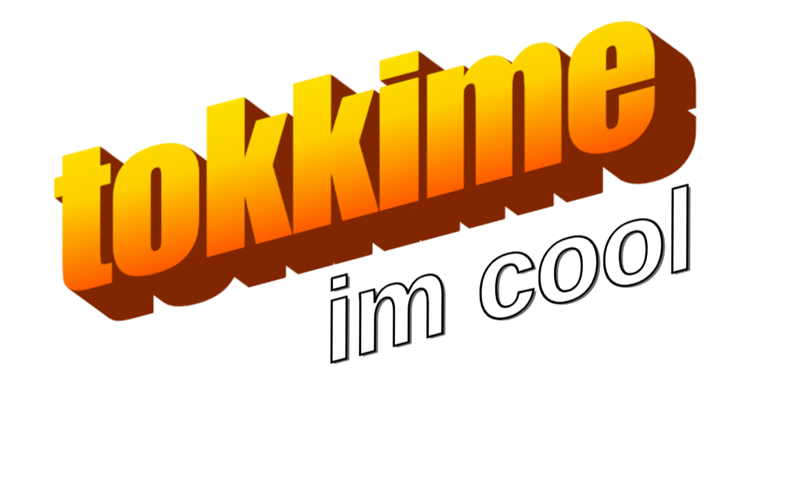

  

 

##  Hello, World!

I'm a rookie backend developer, trying to survive in Brazil 🇧🇷

### About Me

>I'm <b>Gustavo</b> 
>I'm 16 
>I live in <b>São Paulo, Brazil</b> 
>I'm hustlin' hard to become a <b>backend developer</b> 
>I'm all about that <b>money 💰</b>

##  Skills
Note that I'm learning all of this, I don't have full knowledge yet, and I'm constantly leveling up my skills.

#

##  Projects

404 Error: No Projects Found

## 📍 You can find me here

  Or just shoot me an <a href="mailto:tu9jomx4@duck.com">email</a>

 

#

  <h3 style="color: #1DB954;">Currently jamming on my Spotify</h3>
  

#

Please follow me, it was a real hassle to make everything look this good (seriously, dude).

 

  

